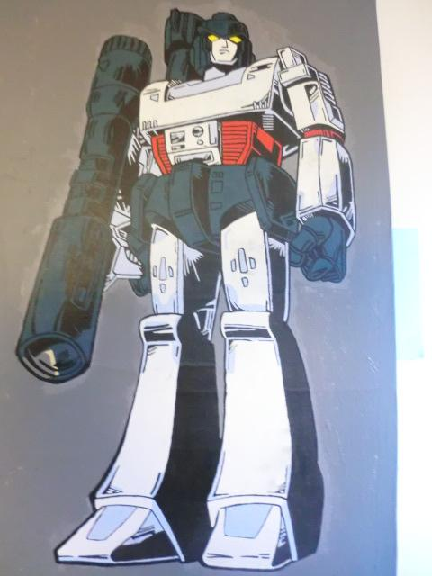
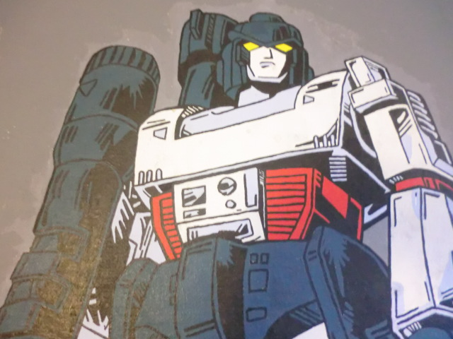
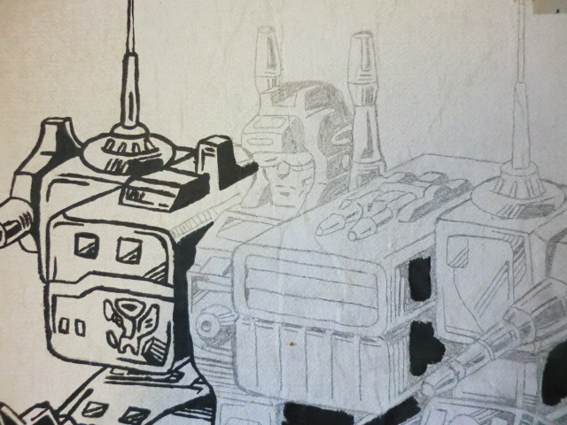
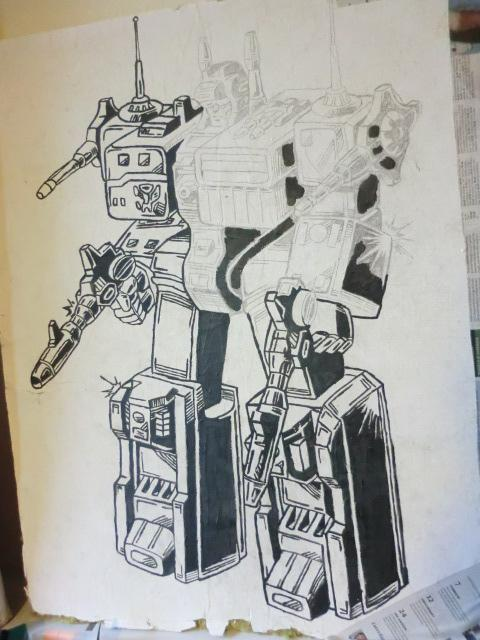
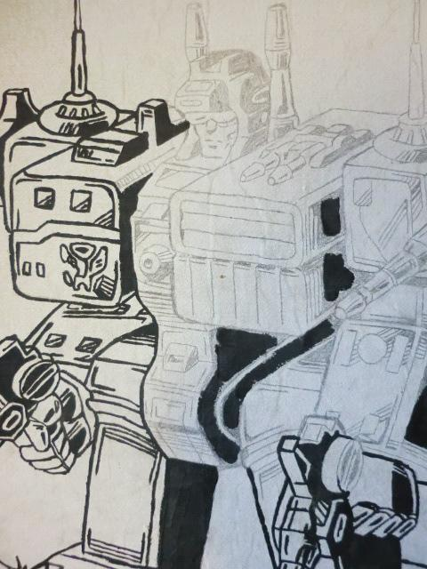
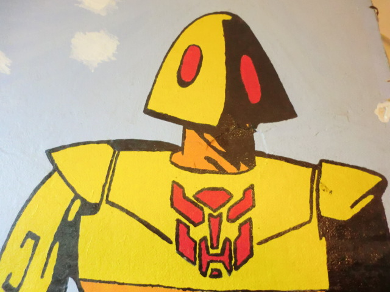
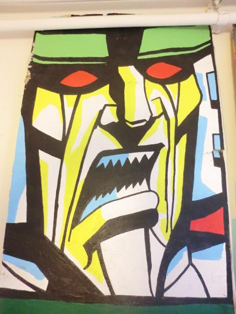

# transformers_paintings

My Transformers paintings.

Most of these I made for 'De Suite', a room in
the 'Biologisch Centrum' in Haren (province of Groningen, in
the Netherlands). I've created about a twenty of them,
some with help of others.

The plates I still remember were:

- A scraplet (no image, by Gerarda de Groot)
- Jazz  (no image, together with Maarten Bleeker)
- Megatron (finished, see image below, took ~20 hours)
- Metroplex (unfinished)
- Scorponoc (finished, see below)
- Scrounge (finished, see below)
- Straxus (finished, see below)

For material, I used rectangular plates that were part
of the ceiling. They were light and itched.

The process was:
- Project an image onto the plate, draw over the lines with a pencil
- Strengthen the lines by using black acrylic paint
- Paint the surfaces with colored acrylic paint
- Redo the black lines with acrylic paint

Many of the plates were damaged when being moved
from the 'Biologisch Centrum' to the Linneausborg.
Some were damaged so much that these were thrown away
immediately.

In the end, some plates ended up at my place,
after which these were given away.

## Megatron

## Metroplex

## Optimus Prime

This image I draw on the wall of where I lived.

## Scorponoc

## Scorponoc, Straxus and Megatron

## Scrounge

## Straxus

